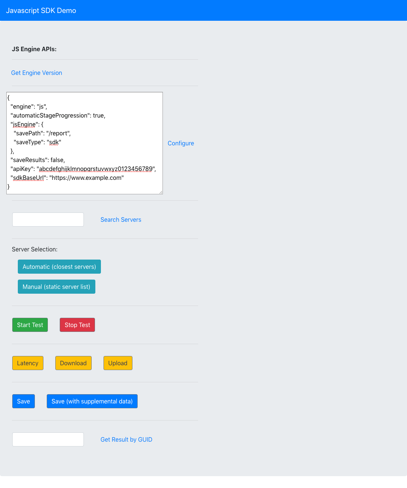
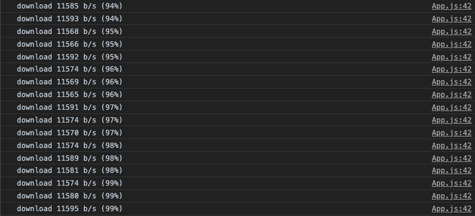
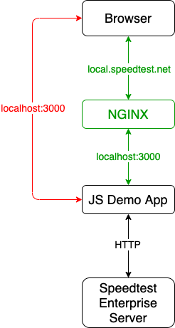

# speedtest-js-demo





## Overview

The Speedtest JS SDK demo app provides code examples with the JS SDK APIs.  Output is printed to the browser's console.

## Requirements

Before the demo app can be used locally:

* The demo app and its dependencies must be installed via `npm`
* The JS engine must be properly configured with the appropriate `apiKey` and `sdkBaseUrl`
* The local setup needs to be in place to avoid cross-origin resource sharing failures

The following sections provide installation instructions: dependencies, configuration, and local setup with reverse proxy.

## Installation

### Dependencies

* `npm` version 8 or above should be installed and available on the PATH

### Instructions

1. Extract `speedtest-js-demo.zip`
2. Install npm dependencies by executing the command `npm i`
3. Start the Speedtest JS SDK demo app by exeucting the command `npm start`

* **Note:** The Speedtest JS SDK demo app will be started on `localhost:3000`.  Any HTTP request from this origin will result in
a cross-origin resource sharing (CORS) failure.  See the **Local Setup with Reverse Proxy** section below.

### Configuration

The JS engine needs to be configured with the `apiKey` and `sdkBaseUrl` associated with your Speedtest JS SDK account.
Refer to the Speedtest JS SDK documentation for further details.

## Local Setup with Reverse Proxy

Your JS SDK API key allows authorization to the JS SDK API for requests from your account's origin only.  Thus, a local development
environment would need a reverse proxy to be setup to populate the `Origin` header with this expected value in all HTTP requests
associated with your SDK API key.  If the SDK API key and origin are authorized, then the Speedtest Enterprise Server responds to HTTP requests
with the `Access-Control-Allow-Origin` header populated with the `Origin` value from the HTTP request.  This section provides an example
to setup NGINX as a reverse proxy for `local.speedtest.net`.

### Reverse Proxy Overview

By default the command `npm start` opens the browser to `localhost:3000`.  However, any HTTP request made directly from `localhost:3000`
will fail due to cross-origin resource sharing (see red path below).  Thus, NGINX can be used as a reverse proxy to avoid this failure
(see green path below).



### Reverse Proxy Installation

**1. Install NGINX**

This document assumes the install path is `/usr/local/etc/nginx/`


**2. Add `local.speedtest.net` to the hosts file**

```
127.0.0.1   local.speedtest.net
```

**3. Place the following contents in `/usr/local/etc/nginx/nginx.conf`**

```
worker_processes  1;

events {
    worker_connections  1024;
}

http {
    include       mime.types;
    default_type  application/octet-stream;
    sendfile        on;
    keepalive_timeout  65;

    # JS SDK
    include servers/local.speedtest.net;
}
```

**4. create a folder `/usr/local/etc/nginx/servers`**

```
$ mkdir -p /usr/local/etc/nginx/servers
```

**5. place a file named `local.speedtest.net` with the following contents in `/usr/local/etc/nginx/servers/`**

```
#
# reverse proxy for JS SDK
#
server {
  listen 80;
  server_name
    local.speedtest.net
  ;
  client_max_body_size 10m;
  location / {
    proxy_pass http://127.0.0.1:3000;
    proxy_http_version 1.1;
    proxy_set_header  Host       $host;
    proxy_set_header  X-Forwarded-Proto http;
    proxy_set_header  Connection upgrade;
    proxy_set_header  Upgrade $http_upgrade;
    proxy_pass_header Set-Cookie;
    proxy_pass_header P3P;
  }
}
```

**6. start NGINX**

